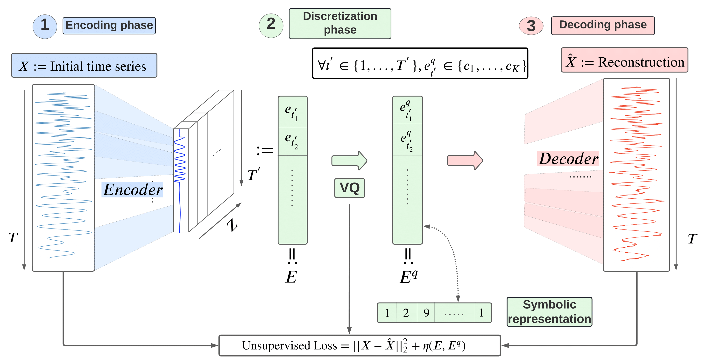

# Interpretable Time Series Neural Representation for Classification  

**Paper:** [Interpretable time series neural representation for classification purposes](https://arxiv.org/pdf/2310.16696)
📄 Published in **IEEE DSAA 2023 (Best Research Paper Award)**

<p align="center">
  
</p>

---

## 1. Overview  

This repository contains the full implementation of our **interpretable neural approach for time series classification**.  
The method leverages **equivariant neural networks** and **vector-quantized latent representations** to extract meaningful features from time series, enabling both high classification performance and interpretability.  

This repository provides:  
1. Core **unsupervised representation learning models** and **classifiers**.  
2. Some preprocessed **datasets** from the UCR archive.  
3. Scripts to reproduce experiments and evaluate models.  

---

## 2. Repository Structure  

```bash
Project/
├── data/                         # Example of preprocessed datasets (UCR archive)
│   ├── PowerCons_TEST/           # Test tensors for Power Consumption dataset
│   ├── PowerCons_TRAIN/          # Train tensors
│   ├── ShapeletSim_TEST/
│   ├── ShapeletSim_TRAIN/
│   ├── SmallKitchenAppliances_TEST/
│   └── SmallKitchenAppliances_TRAIN/
│
├── codes/                        # All code for experiments
│   ├── classifiers/              # Classification models
│   │   └── logistic_reg_equi_ensemble.py
│   ├── unsupervised_model/       # Representation learning models
│   │   ├── compute_ngrams_equi.py
│   │   ├── equivariance_nn.py
│   │   ├── equivariant_ae_blocks.py
│   │   └── train_VQ_equi.py
│   ├── utils/                    # Training utilities
│   │   └── train_utils.py
│   └── main.sh                   # Script to run full pipeline
│   └── README.mdr                # Specific readme for running the experiments 
│
├── results/                      # Outputs from experiments
│   ├── results_csv/              # CSV results
│   └── trained_models/           # Saved models
│
├── DataSummary.csv                # Dataset statistics from UCR archive
├── requirements.txt               # Python dependencies
└── README.md                      # This file
```

## 3. Running Experiments  

Please read the  `codes/README.md` file.  

---

## 4. Data Format

The datasets in `data/` are **z-normalized** and stored as PyTorch tensors:  
- `X_tensor.pt` → Input time series (shape: samples × time × channels)  
- `y_tensor.pt` → Labels (shape: samples × 1)  

**Supported datasets**: Power Consumption, ShapeletSim, SmallKitchenAppliances (from UCR archive).  
[UCR Time Series Archive](https://www.cs.ucr.edu/~eamonn/time_series_data_2018/)

---

## 5. Dependencies

Install required Python packages:  

```bash
pip install -r requirements.txt
```

Key packages: `torch`, `numpy`, `pandas`, `scikit-learn`

---

## 6. References

Some parts of our code reused open access works:  

- [PyTorch VQ-VAE](https://github.com/zalandoresearch/pytorch-vq-vae)  
- [Unsupervised Scalable Representation Learning for Time Series](https://github.com/White-Link/UnsupervisedScalableRepresentationLearningTimeSeries)  
- [VQ-VAE Speech](https://github.com/swasun/VQ-VAE-Speech)  
- [Truly Shift-Invariant CNNs](https://github.com/achaman2/truly_shift_invariant_cnns)

---

## 7. Citation

If you use this work in your research, please cite:

```bibtex
@inproceedings{le2023interpretable,
  title={Interpretable time series neural representation for classification purposes},
  author={Le Naour, Etienne et al.},
  booktitle={IEEE DSAA},
  year={2023},
  note={Best Research Paper Award}
}
```
---

## 8. Contact

📧 Etienne Le Naour — etienne.le-naour@edf.fr  

If you find this repository useful, please consider ⭐ starring it or citing our work!  
